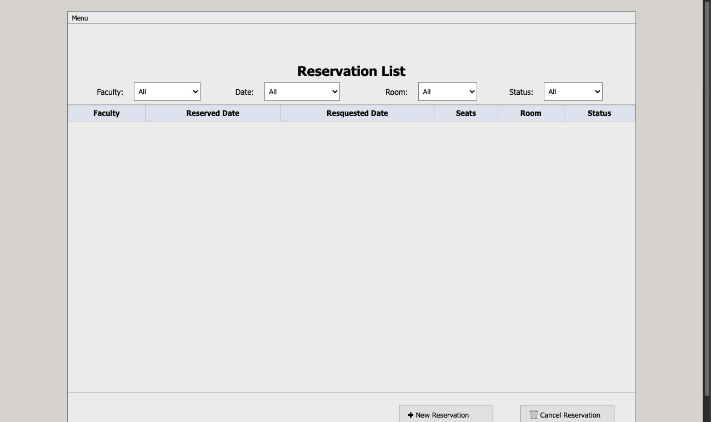

# Room Scheduler

A tool for managing room bookings across a building. Administrators can add rooms with seat capacities, assign faculty to rooms on specific dates, and the system automatically picks the most space-efficient room available. If no suitable room is free, the request is placed on a waiting list and automatically fulfilled when a cancellation opens up.

Originally built as a Java desktop application with a SQL database, then rebuilt as a fully interactive browser app — the same logic runs entirely in the browser with no server required.

**[Live Demo](https://halkhoori2000.github.io/Room-Scheduler/)**



## Use Cases
- University classroom and lab allocation across academic schedules
- Corporate meeting room booking with seat capacity and equipment constraints
- Conference facility management where a fixed pool of rooms serves a rotating pool of requesters
- Any scheduling system where demand exceeds supply and fair queuing must be enforced automatically

## Challenges
- **Best-fit assignment**: finding the smallest room that still fits the group without leaving excess capacity unused, while never under-allocating — requires evaluating all available rooms and selecting optimally on every booking
- **Cascading waitlist promotion**: when a room is deleted or a reservation cancelled, multiple waitlisted entries may become eligible simultaneously — the system must re-run best-fit across all pending requests in FIFO order to correctly fill freed capacity without double-promoting or skipping entries
- **State consistency across operations**: cancellations, deletions, and new reservations all modify the same waitlist and reservation set — sequencing these correctly so every state transition leaves the system in a valid, consistent state

---

## Overview

The system allows administrators to manage faculty, rooms, dates, and reservations. It implements automatic room assignment using a best-fit algorithm and a FIFO waitlist that promotes entries when rooms become available or are cancelled.

## Features

- Add faculty members, rooms (with seat capacity), and available dates
- Reserve a room for a faculty member on a specific date — smallest fitting room is automatically assigned
- Waitlist: if no room fits, the reservation is queued and promoted automatically when capacity frees up
- Cancel reservations — waitlisted entries are promoted immediately
- Delete rooms — active reservations are reassigned or waitlisted, waitlisted entries may be promoted
- Filter reservations by faculty, date, room, and status
- All data persisted in `localStorage` — no backend required

## Tech Stack

| Layer | Original | Web Version |
|---|---|---|
| UI | Java Swing (NetBeans GroupLayout) | HTML / CSS |
| Storage | Apache Derby (embedded SQL DB) | localStorage |
| Logic | Java services + DAOs | Vanilla JavaScript |
| Platform | Desktop (JVM) | Browser |

## Project Structure

```
Room-Scheduler/
├── index.html      # Complete browser app (live demo)
└── src/            # Original Java Swing source code
    ├── RoomScheduler.java
    ├── constant/
    ├── dao/
    ├── dto/
    ├── model/
    ├── service/
    ├── utils/
    └── component/
```

## Running the Web Version

Open `index.html` directly in any modern browser — no server or build step needed.

## Original Java App

The `src/` folder contains the full Java source. Built with NetBeans IDE using:
- **Java Swing** — GroupLayout for pixel-accurate UI
- **Apache Derby** — embedded relational database for persistence
- **DAO / Service pattern** — clean separation of data access and business logic

To run the original app, open the project in NetBeans with Apache Derby configured and run `RoomScheduler.java`.
